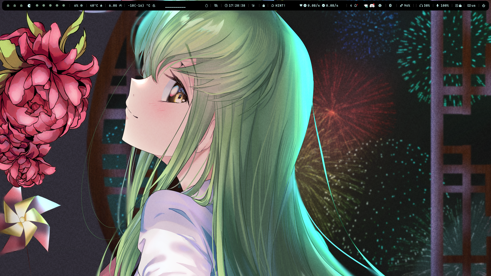
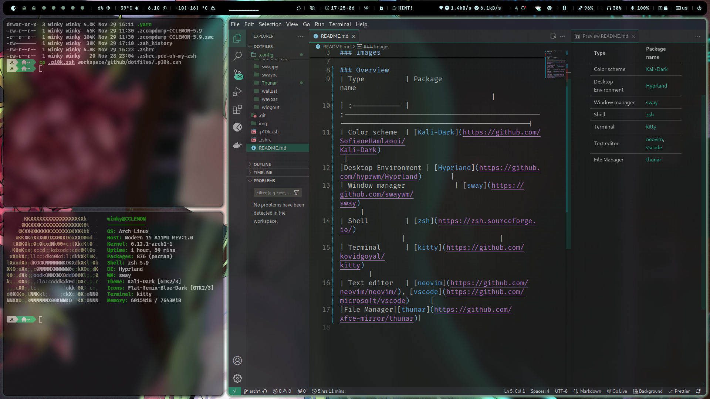
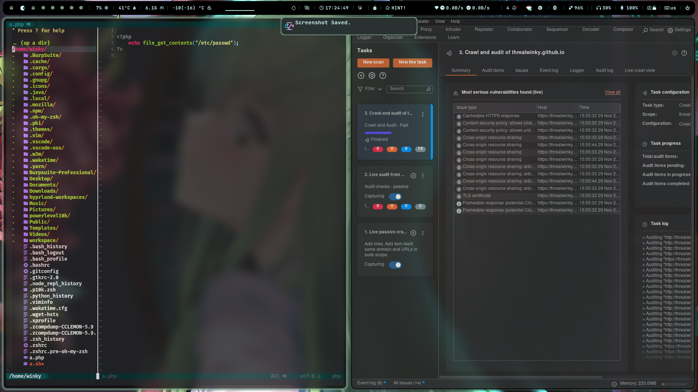
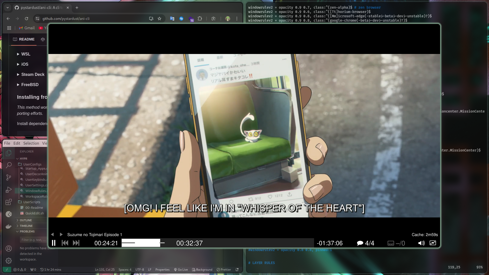

<h2 align="center">My archlinux dotfiles</h2>

### Images

### Overview
| Type          | Package name                                                                                  |
| :------------ |:----------------------------------------------------------------------------------------------|
| Color scheme  | [Kali-Dark](https://github.com/SofianeHamlaoui/Kali-Dark)                                        |
|Desktop Environment | [Hyprland](https://github.com/hyprwm/Hyprland)       |
| Window manager            | [sway](https://github.com/swaywm/sway)                                                 |
| Shell         | [zsh](https://zsh.sourceforge.io/)                                                            |                       |
| Terminal      | [kitty](https://github.com/kovidgoyal/kitty)                                                  |
| Text editor   | [neovim](https://github.com/neovim/neovim/), [vscode](https://github.com/microsoft/vscode)     |
|File Manager|[thunar](https://github.com/xfce-mirror/thunar)|
|Keyboard|[fcitx](https://github.com/fcitx/fcitx5)|